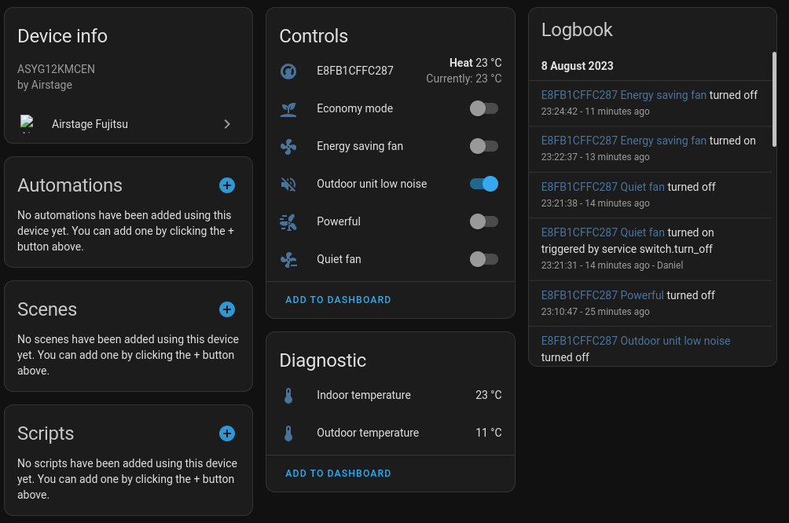
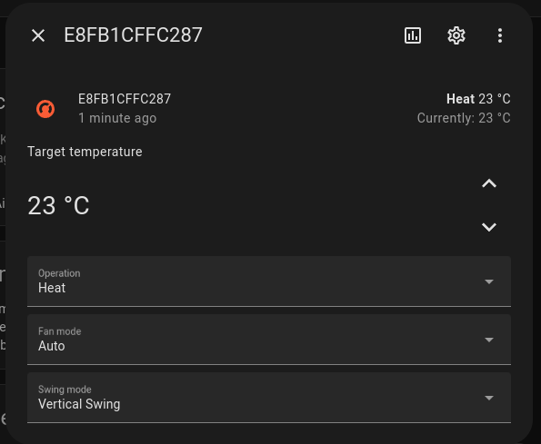
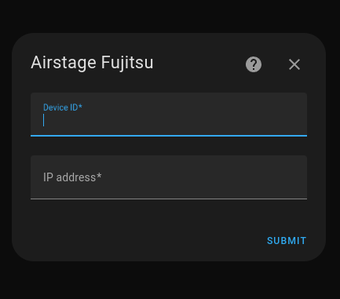
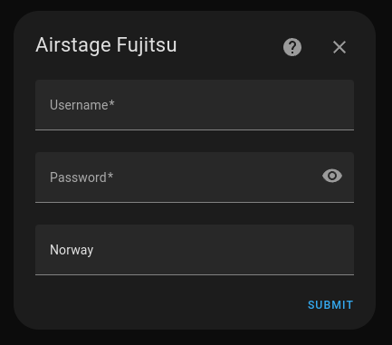

# Asynchronous Fujitsu Airstage component for Home Assistant.

## Features

Climate integration for Fujitsu Airstage air conditioners.

Controls:

- AC operation
- Temperature
- Fan mode
- Swing mode
- Economy mode
- Energy saving fan mode
- Outdoor unit low noise mode
- Powerful mode
- Quiet fan mode

## Configuration

After install go to "Add integration" and search after Fujitsu Airstage.

### Control modes

There are two ways to connect to your Airstage devices

- Local (recommended)
- Cloud

#### Local

To add a local device you need the IP Address and Device ID. On my device the MAC address was stated so it was easy to find the IP address on my local network.
The device id is the same as the MAC address exept the ":". Or you can scan the wifi SSID and remove the "AP-WH3X-" the device id is the last 12 characters.

#### Cloud

WARING: while writing this code and testing against the Airstage rest api I was locked out from the service. They blocked my public IP from using the api (which effects also the mobile app). The local environment still works, but the app want you to change wifi to the local hot-spot on the device, which sucks. The local mode on this integration still work even my public ip is blocked.

You need your email and password used on the Airstage app. Also you need your country, my case it was Norway. Will add all your Airstage devices connected to the account.

## Documentation

Please visit the [Readme](https://raw.githubusercontent.com/danielkaldheim/ha_airstage/main/README.md) for full documentation.
